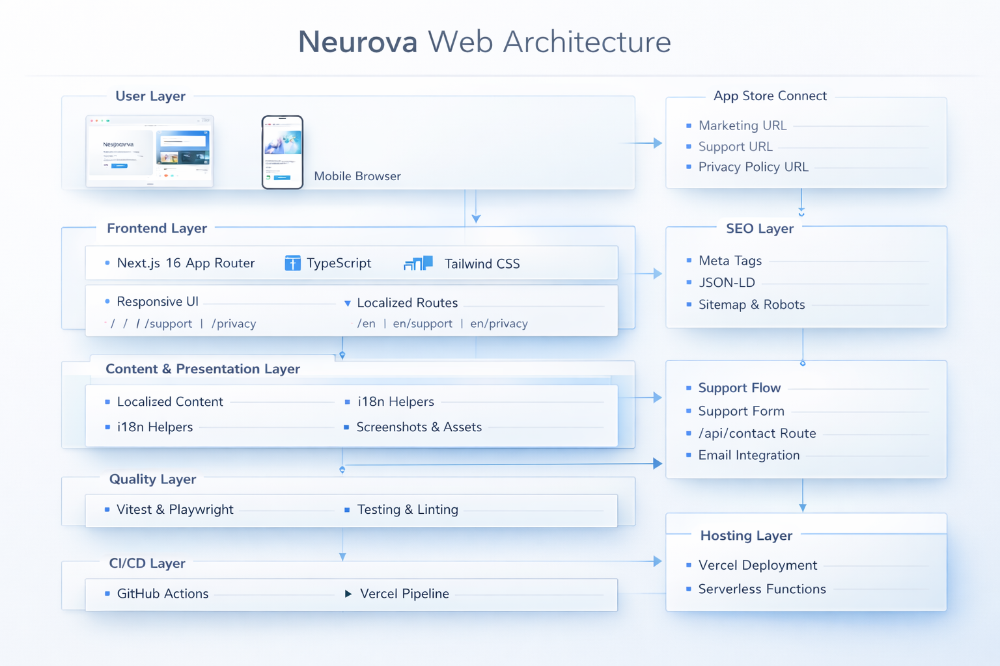

# Neurova Web

Official marketing, support, and privacy website for the Neurova iOS app.

Neurova Web is a production-oriented Next.js marketing site designed to cover the three App Store Connect surfaces the product needs:

- Marketing URL: `/`
- Support URL: `/support`
- Privacy Policy URL: `/privacy`

The project is built with `Next.js` App Router, `TypeScript`, and `Tailwind CSS`, with bilingual routes, strong SEO foundations, a real testing strategy, and CI/CD automation.

## Highlights

- Premium bilingual landing experience in Spanish and English
- Reusable marketing components and centralized content/configuration
- Support flow with client validation and a mock-ready `/api/contact` endpoint
- Privacy Policy page aligned with the Neurova product model
- Strong SEO layer: metadata, OG image, sitemap, robots, manifest, structured data, alternates
- Unit and end-to-end test coverage with CI enforcement
- GitHub Actions quality gate plus optional Vercel deployment workflow

## Stack

- `Next.js 16`
- `React 19`
- `TypeScript`
- `Tailwind CSS 4`
- `Vitest` + `React Testing Library`
- `Playwright`
- `GitHub Actions`

## Visual Architecture



## Documentation

- Overview: [docs/README.md](docs/README.md)
- Architecture: [docs/architecture.md](docs/architecture.md)
- Testing: [docs/testing.md](docs/testing.md)
- SEO: [docs/seo.md](docs/seo.md)
- Deployment: [docs/deployment.md](docs/deployment.md)
- Visual reference: [docs/visual-reference.md](docs/visual-reference.md)

## Project Structure

```text
app/
  api/contact/route.ts
  en/
  layout.tsx
  manifest.ts
  opengraph-image.tsx
  page.tsx
  privacy/page.tsx
  robots.ts
  sitemap.ts
  support/page.tsx
  support/success/page.tsx
components/marketing/
lib/
tests/
docs/
```

## Getting Started

```bash
npm install
npm run dev
```

Open `http://localhost:3000`.

## Available Scripts

```bash
npm run dev
npm run build
npm run start
npm run lint
npm run typecheck
npm run test
npm run test:coverage
npm run test:e2e
```

## Environment Variables

The site works locally without extra setup, but these variables should be configured for production:

```bash
NEXT_PUBLIC_SITE_URL=https://neurova.app
NEXT_PUBLIC_APP_STORE_URL=https://apps.apple.com/app/idXXXXXXXXXX
NEXT_PUBLIC_APP_STORE_ID=XXXXXXXXXX
NEXT_PUBLIC_APP_SCHEME=neurova://
```

Notes:

- `NEXT_PUBLIC_SITE_URL` should always match the final production domain.
- `NEXT_PUBLIC_APP_STORE_URL` is the App Store destination for all download CTAs.
- `NEXT_PUBLIC_APP_STORE_ID` improves app-related metadata and smart linking.
- `NEXT_PUBLIC_APP_SCHEME` is optional and only needed if you want deep-link aware metadata.

## Quality Gate

The project is expected to pass all of the following before shipping:

- `npm run lint`
- `npm run typecheck`
- `npm run test:coverage`
- `npm run build`
- `npm run test:e2e`

## CI/CD

Two GitHub Actions workflows are included:

- `.github/workflows/ci.yml`
  - runs on every push and pull request
  - executes lint, typecheck, unit coverage, build, and E2E
- `.github/workflows/deploy-vercel.yml`
  - prepared for production deployments through the Vercel CLI
  - only deploys when the required Vercel secrets are available

If the repository is already connected directly to Vercel through the Git integration, you can keep using GitHub Actions for CI only and let Vercel handle deploys natively.

## Editing Content

The main content sources live here:

- Site copy: [lib/site-content.ts](lib/site-content.ts)
- App/site config: [lib/site-config.ts](lib/site-config.ts)
- Metadata helpers: [lib/metadata.ts](lib/metadata.ts)
- SEO helpers: [lib/seo.ts](lib/seo.ts)

## Support Contact

The support email is currently configured in [lib/site-config.ts](lib/site-config.ts).

## License

Private project.
