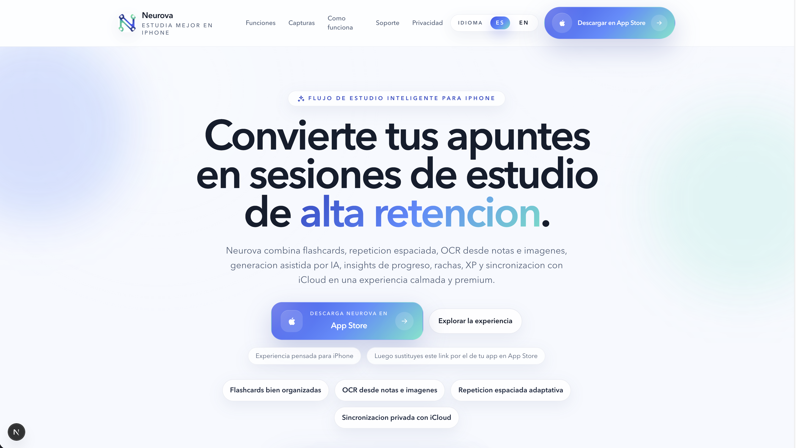
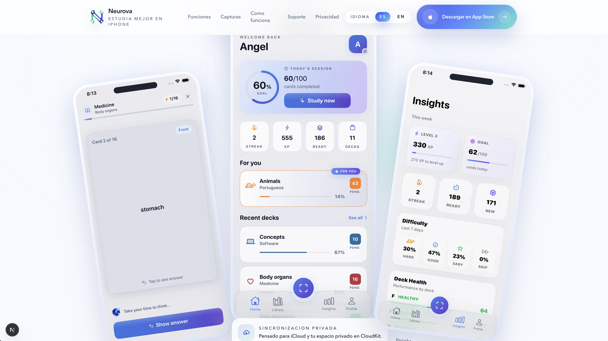
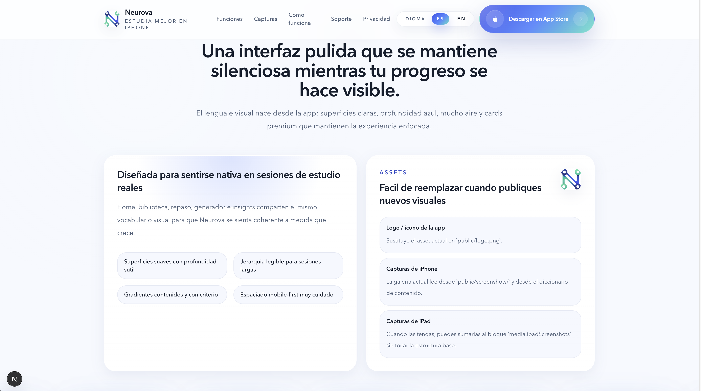
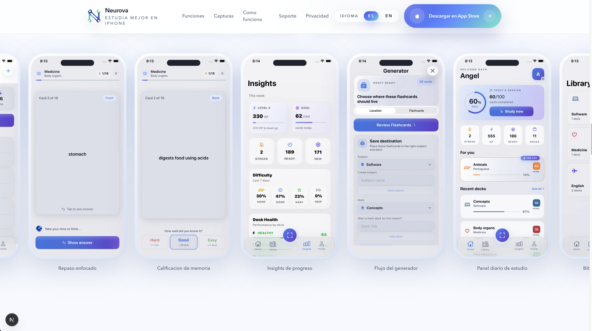
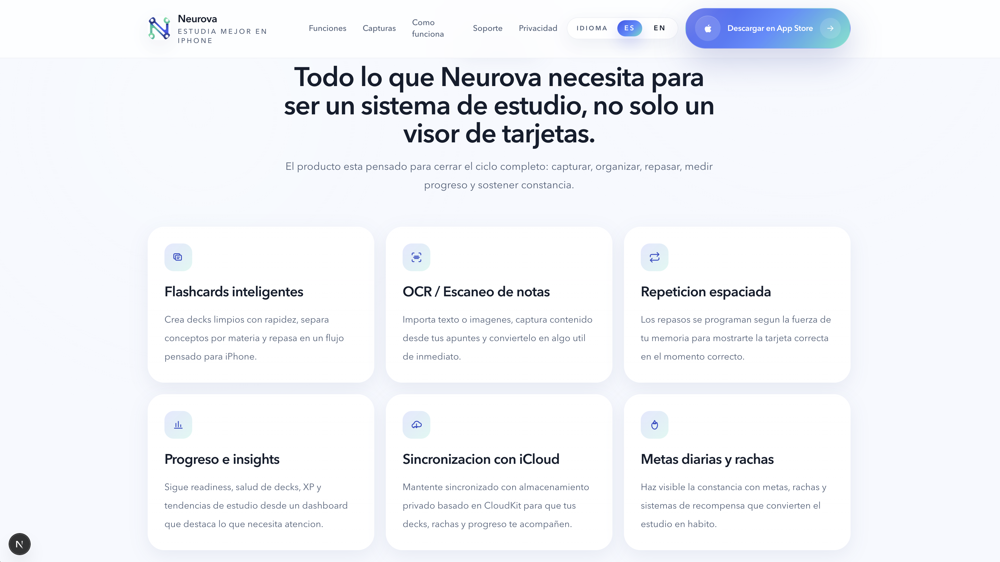
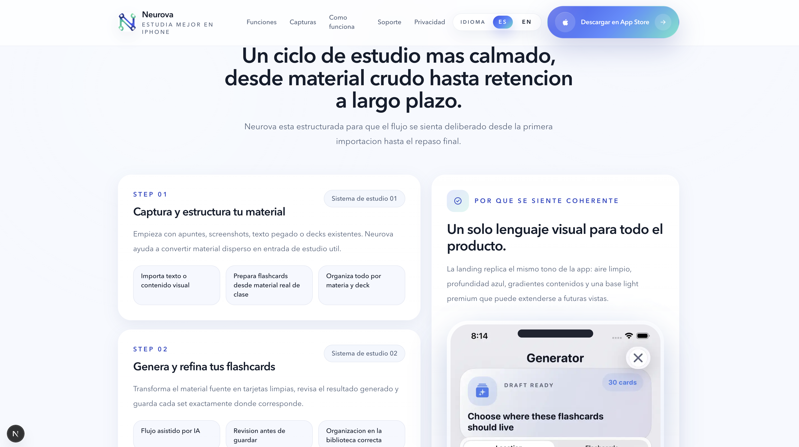
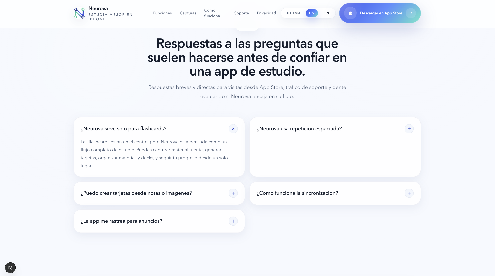
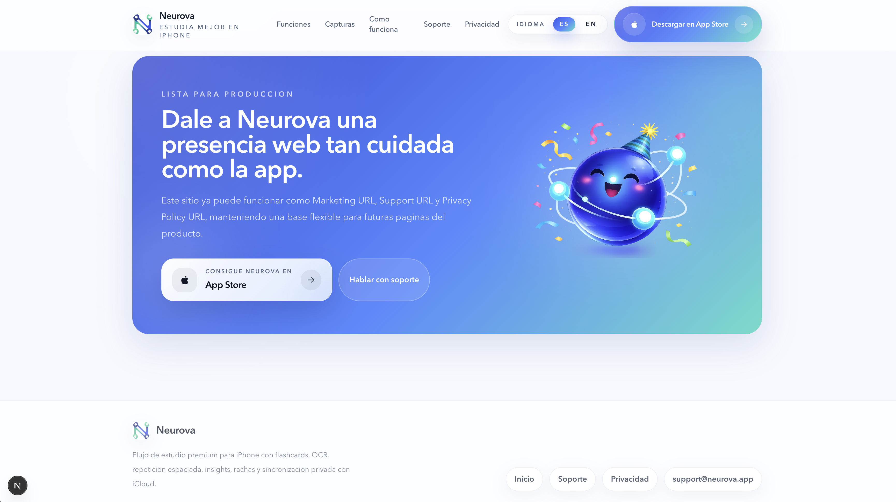

# Visual Reference

This page groups the current visual assets used to document the landing experience and the architecture.

## Architecture

## Landing Capture Sequence

The screenshots below are stored as sequential visual references for the landing page. They follow the current capture order from top to bottom.

### Reference 01

### Reference 02

### Reference 03

### Reference 04

### Reference 05

### Reference 06

### Reference 07

### Reference 08

## Notes

- These captures live under `docs/assets/screenshots/landing/`.
- They are documentation assets only and are not used by the production app at runtime.
- If the UI changes significantly, update this folder and keep the numbering sequence stable.
